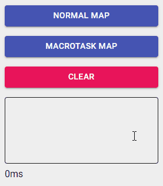
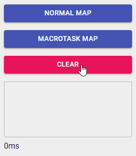

# concurrent-each

An async map function to push tasks onto the macroqueue to prevent UI lock up while processing large volumes of data in batches.

# Install

Using npm:

```
npm install concurrent-each --save
```

# In Action

Timing difference is caused by background CPU tasks.

| Normal Map      | Concurrent-each Map |
| --------------- | ------------------- |
|  |  |

# Usage

```js
ceach.map(array, mapFunction, batchSize); - Array, Function, (optional) Number
ceach.forEach(array, callback, batchSize); - Array, Function, (optional) Number
ceach.reduce(array, reducer, initialValue, batchSize); - Array, Function, (optional) Number
```

# Examples

## Map

```js
import ceach from 'concurrent-each';

const array = ['a', 'b', 'c', ...]; // Large array
const data = await ceach.map(array, (data) => data.toUpperCase(), 10);
```

## ForEach

```js
import ceach from 'concurrent-each';

const array = ['a', 'b', 'c', ...]; // Large array

await ceach.forEach(
  array,
  (item) => {
    // Run some code
  },
  10
);
```

## Reduce

```js
import ceach from 'concurrent-each';

const array = [1, 2, 3, ...]; // Large array
const data = await ceach.reduce(array, (acc, curr) => (acc += curr), 0, 10);
```

# License

MIT License

Copyright (c) 2021 xdact

Permission is hereby granted, free of charge, to any person obtaining a copy
of this software and associated documentation files (the "Software"), to deal
in the Software without restriction, including without limitation the rights
to use, copy, modify, merge, publish, distribute, sublicense, and/or sell
copies of the Software, and to permit persons to whom the Software is
furnished to do so, subject to the following conditions:

The above copyright notice and this permission notice shall be included in all
copies or substantial portions of the Software.

THE SOFTWARE IS PROVIDED "AS IS", WITHOUT WARRANTY OF ANY KIND, EXPRESS OR
IMPLIED, INCLUDING BUT NOT LIMITED TO THE WARRANTIES OF MERCHANTABILITY,
FITNESS FOR A PARTICULAR PURPOSE AND NONINFRINGEMENT. IN NO EVENT SHALL THE
AUTHORS OR COPYRIGHT HOLDERS BE LIABLE FOR ANY CLAIM, DAMAGES OR OTHER
LIABILITY, WHETHER IN AN ACTION OF CONTRACT, TORT OR OTHERWISE, ARISING FROM,
OUT OF OR IN CONNECTION WITH THE SOFTWARE OR THE USE OR OTHER DEALINGS IN THE
SOFTWARE.
